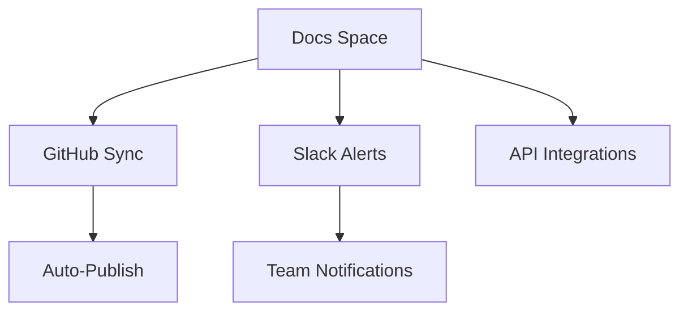

## Overview

Tailor your Brien Austin Clayton Documentation space to match your project's needs. Adjust space settings, apply custom themes with brand color `#3B82F6`, manage user permissions, and set up integrations. These options ensure seamless collaboration and branding consistency.

<Columns cols={3}>
  <Card title="Space Settings" icon="settings" href="#space-settings">
    Define basic space properties and defaults.
  </Card>
  <Card title="Theme Customization" icon="palette" href="#theme-customization">
    Apply your brand colors and styles.
  </Card>
  <Card title="Permissions" icon="shield" href="#permissions">
    Control access levels for teams.
  </Card>
</Columns>

## Space Settings

Configure foundational options for your documentation space.

<Steps>
  <Step title="Access Space Admin" icon="user-cog">
    Navigate to your space settings via the admin panel.
  </Step>
  <Step title="Update Name and Description" icon="edit">
    Set the space name to "Brien Austin Clayton Documentation" and add a description like "Project docs hub".
  </Step>
  <Step title="Set Default Permissions" icon="lock">
    Choose public or private access as needed.
  </Step>
</Steps>

## Theme and Branding Customization

Personalize the visual appearance using CSS variables and theme files.

<Tabs>
  <Tab title="JSON Config" icon="code">
    Update your theme configuration with brand colors.

    <CodeGroup tabs="JSON,YAML">
```json
{
  "theme": {
    "primaryColor": "#3B82F6",
    "secondaryColor": "#1E40AF",
    "fontFamily": "Inter, sans-serif"
  },
  "logo": "https://your-domain.com/logo.svg"
}
```
```yaml
theme:
  primaryColor: '#3B82F6'
  secondaryColor: '#1E40AF'
  fontFamily: 'Inter, sans-serif'
logo: https://your-domain.com/logo.svg
```
    </CodeGroup>
  </Tab>
  <Tab title="CSS Variables" icon="css3">
    Override styles directly.

````css
:root {
  --brand-primary: #3B82F6;
  --brand-secondary: #1E40AF;
  --header-bg: linear-gradient(135deg, var(--brand-primary), var(--brand-secondary));
}
````
  </Tab>
</Tabs>

<Callout kind="tip">
  Test theme changes in preview mode before publishing to avoid disrupting users.
</Callout>

## Permissions and Access Control

Manage who can view, edit, or administer your documentation.

| Role          | View | Edit | Admin | Description                          |
|---------------|------|------|-------|--------------------------------------|
| Viewer        | ✅   | ❌   | ❌    | Read-only access to all pages.       |
| Editor        | ✅   | ✅   | ❌    | Edit content and metadata.           |
| Administrator | ✅   | ✅   | ✅    | Full control including user management. |

<Expandable title="Advanced Permission Rules" default-open="false">
  Use role-based access control (RBAC) with custom groups. Assign permissions via API:

```javascript
await api.updateSpacePermissions({
  spaceId: 'your-space-id',
  roles: {
    editors: ['user@example.com'],
    admins: ['admin@company.com']
  }
});
```
</Expandable>

## Integration Configurations

Connect external services for enhanced functionality.

<Columns cols={2}>
  <Card title="GitHub Sync" icon="github" horizontal>
    Automatically sync repos. Use webhook URL: `https://your-webhook-url.com/github`.
  </Card>
  <Card title="Slack Notifications" icon="message-circle" horizontal>
    Send updates to channels. Config: `https://your-slack-webhook.com/notify`.
  </Card>
</Columns>

<Callout kind="alert">
  Secure all integration tokens. Store them as environment variables like `process.env.GITHUB_TOKEN`.
</Callout>



These configurations optimize your workflow. Review changes in a staging environment first.