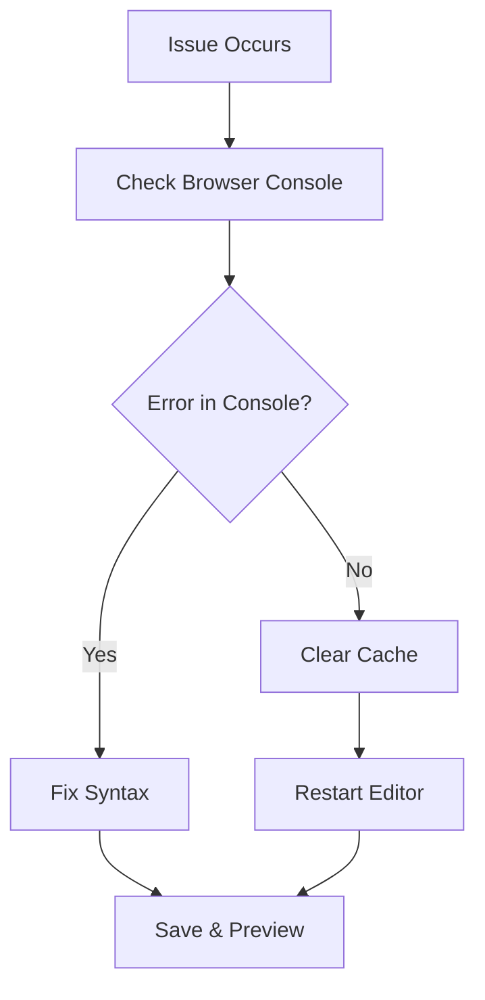

## Account and Billing

Manage your subscription and account settings efficiently on the Brien Austin Clayton Documentation platform.

<Callout kind="info">
  Upgrade your plan anytime through the dashboard to unlock advanced features like custom domains and team collaboration.
</Callout>

| Plan | Price | Features |
|------|-------|----------|
| Free | $0/mo | 5 docs, basic MDX support |
| Pro | $19/mo | Unlimited docs, custom themes, analytics |
| Enterprise | $99/mo | Teams, SSO, priority support |

<ExpandableGroup>
  <Expandable title="How do I update my billing information?">
    Navigate to **Account > Billing** in your dashboard. Click **Update Payment Method** and enter your new card details. Changes take effect immediately.
  </Expandable>

  <Expandable title="What payment methods do you accept?">
    Accept major credit cards (Visa, Mastercard, Amex), PayPal, and ACH transfers. All payments process securely via Stripe.
  </Expandable>
</ExpandableGroup>

## Document Management

Organize and edit your MDX documentation with these essential tools.

<Columns cols={2}>
  <Card title="Create New Doc" icon="file-plus" href="/docs/create">
    Start a new documentation page in seconds.
  </Card>
  <Card title="Version History" icon="git-branch" href="/docs/versions">
    Track changes and revert easily.
  </Card>
</Columns>

<Steps>
  <Step title="Create a Document" icon="plus">
    Click **New Doc** in the sidebar. Choose a template or start blank. Add YAML frontmatter for metadata.
  </Step>
  <Step title="Add Components" icon="components">
    Insert components like `<Callout>` or `<Steps>`. Preview live as you edit.
  </Step>
  <Step title="Publish" icon="globe">
    Hit **Publish** to make it live. Share via custom URL.
  </Step>
</Steps>

## Troubleshooting Common Issues

Resolve problems quickly with these structured steps.



<Tabs>
  <Tab title="Browser Issues" icon="chrome">
    Clear cache and cookies. Ensure JavaScript is enabled. Test in incognito mode.
  </Tab>
  <Tab title="Editor Freezes" icon="cpu">
    Refresh the page. Close other tabs. If persists, contact support.
  </Tab>
</Tabs>

## Best Practices

Follow these guidelines to maximize your documentation experience.

<Callout kind="tip" default-open="true">
  Always escape special characters like `{variable}` or `<Component>` with backticks in prose to prevent parsing errors.
</Callout>

<CodeGroup tabs="JavaScript,Python">
  ```javascript
  // Correct: Escape in comments
  console.log(`Use {API_KEY} securely`);
  ```
  ```python
  # Correct: Use f-strings safely
  print(f"Set `API_KEY` in env")
  ```
</CodeGroup>

<Expandable title="Advanced MDX Tips">
  Use H2 (##) as your first heading—never H1. Maintain hierarchy with H3 and H4. Include 5-8 components per page for rich content.
</Expandable>

For more, explore the dashboard or contact support via the help icon.