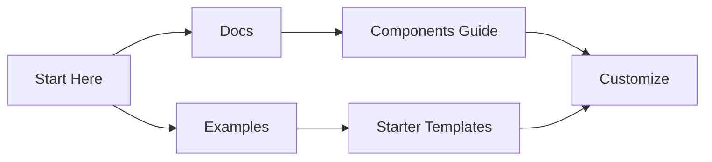

## Overview

Welcome to Brien Austin Clayton Documentation, your centralized platform for creating, organizing, and sharing project documentation. You get a fully customizable space to build comprehensive guides, API references, and tutorials using MDX-powered pages. This default documentation site scales with your projects, supporting version control, search, and collaboration features out of the box.

The platform emphasizes simplicity and power, letting you focus on content while handling rendering, navigation, and deployment automatically.

## Key Features and Benefits

Brien Austin Clayton Documentation offers powerful tools to streamline your workflow. Explore the core capabilities below.

<Columns cols={3}>
  <Card title="MDX-Powered Pages" icon="book-open" href="#">
    Write rich documentation with Markdown and JSX components. Embed interactive elements like tabs and code examples seamlessly.
  </Card>
  <Card title="Version Control" icon="git-branch" href="#">
    Track changes with Git integration. Maintain multiple versions and roll back as needed.
  </Card>
  <Card title="Search & Navigation" icon="search" href="#">
    Built-in full-text search and automatic sidebar generation make finding content effortless.
  </Card>
</Columns>

<Callout kind="tip">
  Customize your site's appearance with brand colors like `#3B82F6` for headers and accents.
</Callout>

## How to Get Started

Follow these steps to set up and publish your first documentation page.

<Steps>
  <Step title="Create Your Site" icon="globe">
    Clone the starter repository and configure your frontmatter.

    <CodeGroup tabs="YAML,JSON">
      ```yaml
      ---
      title: My Project Docs
      description: Custom documentation site
      ---
      ```
      ```json
      {
        "title": "My Project Docs",
        "description": "Custom documentation site"
      }
      ```
    </CodeGroup>
  </Step>

  <Step title="Add Content" icon="edit-3">
    Write MDX pages starting with H2 headings. Use components like `<Card>` for features.

    ```javascript
    import { Card, Columns } from './components';

    <Columns cols={2}>
      <Card title="Feature 1" icon="star" />
    </Columns>
    ```
  </Step>

  <Step title="Deploy" icon="upload-cloud">
    Push to your hosting provider.

    <Tabs>
      <Tab title="Vercel" icon="cloud">
        Connect your Git repo and deploy automatically on push.
      </Tab>
      <Tab title="Netlify" icon="activity">
        Drag your build folder or link Git for continuous deployment.
      </Tab>
    </Tabs>
  </Step>
</Steps>

## Advanced Customization

Tailor the platform to your needs with custom themes and plugins.

<Expandable title="Theme Configuration" default-open="false">
  Edit your `tailwind.config.js` to incorporate the brand color.

  ```javascript
  module.exports = {
    theme: {
      extend: {
        colors: {
          primary: '#3B82F6',
        },
      },
    },
  };
  ```

  Apply classes like `bg-primary` to headers and buttons.
</Expandable>

## Support and Resources

Access help and community resources to accelerate your documentation efforts.



- **Official Docs**: Full component reference and best practices.
- **GitHub Repo**: Fork and contribute at `https://github.com/your-org/brien-austin-clayton-docs`.
- **Community Discord**: Join discussions for tips and troubleshooting.

<Callout kind="info">
  Need help? Check the troubleshooting guide or contact support at `support@brienaustinclayton.com`.
</Callout>