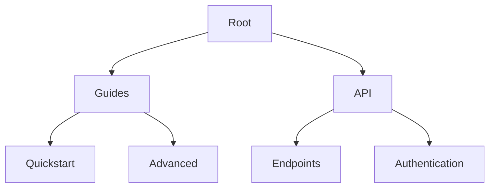

## Overview

Manage your Brien Austin Clayton Documentation space efficiently to keep project information accessible and up-to-date. Organize pages into logical structures, collaborate with team members, and export content for sharing. Follow these steps to create a scalable documentation system.

<Callout kind="tip">

Start with a clear navigation hierarchy using sidebars to guide users through your content.

</Callout>

## Creating and Editing Pages

Build new pages or update existing ones directly in your documentation interface.

<Steps>
  <Step title="Create a New Page" icon="plus">
    Navigate to the root directory or desired folder. Click the "New Page" button and select `page.mdx` as the file type.
  </Step>
  <Step title="Add Frontmatter" icon="settings">
    Insert YAML frontmatter at the top:

````mdx
```yaml
---
title: Your Page Title
description: Brief page summary.
---
```
````
  </Step>
  <Step title="Write Content" icon="edit-3">
    Use Markdown and MDX components. Preview changes in real-time before publishing.
  </Step>
  <Step title="Publish Changes" icon="upload">
    Save and commit. Pages appear instantly in navigation.
  </Step>
</Steps>

## Organizing Document Structure

Structure your docs with sidebars, folders, and links for intuitive navigation.

<Columns cols={2}>
  <Card title="Sidebars" icon="menu" href="#">
    Define navigation menus in `sidebar.js` or `sidebar.ts` files.
  </Card>
  <Card title="Folders" icon="folder" href="#">
    Use directories to group related pages automatically.
  </Card>
  <Card title="Links" icon="link" href="#">
    Add internal links with relative paths like `/guides/advanced`.
  </Card>
  <Card title="Indexes" icon="list" href="#">
    Create `index.mdx` files for folder landing pages.
  </Card>
</Columns>



<CodeGroup tabs="Sidebar Config,Folder Structure">
  ```javascript
  // sidebar.js
  module.exports = {
    docs: [
      {
        type: 'doc',
        id: 'guides/quickstart',
      },
      {
        type: 'category',
        label: 'API',
        items: ['api/endpoints', 'api/auth'],
      },
    ],
  };
  ```
  ```bash
  docs/
  ├── guides/
  │   ├── index.mdx
  │   ├── quickstart.mdx
  │   └── advanced.mdx
  ├── api/
  │   ├── endpoints.mdx
  │   └── auth.mdx
  └── sidebar.js
  ```
</CodeGroup>

## Collaboration Tools

Invite team members and use version control for seamless teamwork.

<Tabs>
  <Tab title="GitHub" icon="github">
    Connect your repo for pull requests and reviews.

    <Steps>
      <Step title="Connect Repo">
        Go to Settings > Version Control > Link GitHub repository.
      </Step>
      <Step title="Review Changes">
        Approve PRs to merge documentation updates.
      </Step>
    </Steps>
  </Tab>
  <Tab title="Slack Notifications" icon="message-circle">
    Set up webhooks for build alerts.

    ```javascript
    // Example webhook payload
    const payload = {
      text: 'Docs updated: managing-docs.mdx',
      channel: '#docs'
    };
    ```
  </Tab>
  <Tab title="Permissions" icon="shield">
    Assign roles: Admin, Editor, Viewer.
  </Tab>
</Tabs>

## Exporting and Sharing Docs

Share your documentation outside the platform.

| Method       | Format      | Use Case                  |
|--------------|-------------|---------------------------|
| Static Export| HTML/ZIP   | Host on your domain      |
| PDF          | PDF        | Printable guides         |
| Embed        | Iframe     | Integrate in apps        |

<ExpandableGroup>
  <Expandable title="Advanced Export Options" default-open="false">

    Customize exports with themes matching your brand color `#3B82F6`.

    ```bash
    npx docs-export --format=html --theme=blue --output=dist/
    ```

  </Expandable>
</ExpandableGroup>

<Callout kind="success">

Regularly review and archive outdated pages to maintain clean documentation.

</Callout>